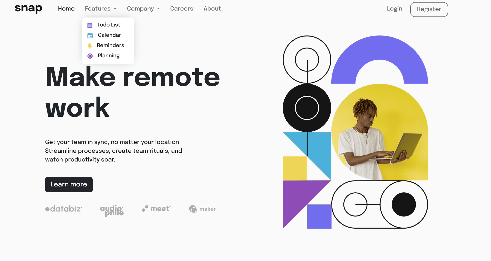
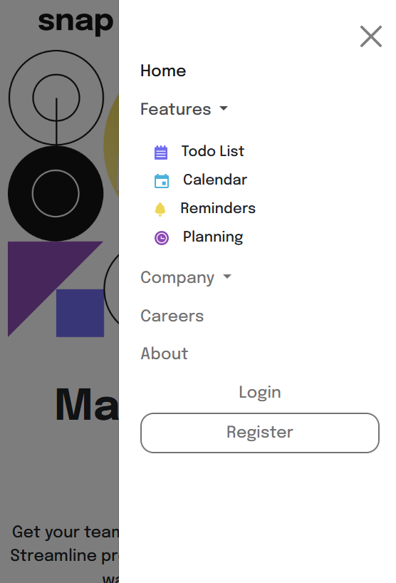

# Frontend Mentor - Intro section with dropdown navigation solution

This is a solution to the [Intro section with dropdown navigation challenge on Frontend Mentor](https://www.frontendmentor.io/challenges/intro-section-with-dropdown-navigation-ryaPetHE5). Frontend Mentor challenges help you improve your coding skills by building realistic projects.

## Table of contents

- [Overview](#overview)
  - [The challenge](#the-challenge)
  - [Screenshot](#screenshot)
  - [Links](#links)
- [My process](#my-process)
  - [Built with](#built-with)
  - [What I learned](#what-i-learned)
  - [Continued development](#continued-development)
  - [Useful resources](#useful-resources)
- [Author](#author)

## Overview
I solve this challenge using HTML, CSS, and Bootstrap. I do this project to practice my skill on HTML, CSS, and Bootstrap. It takes about 3 weeks to complete. There's few times that i want to give up, but i just show up and do the challenge. There's so much that i learn from the process of working on this project.

### The challenge

Users should be able to:

- View the relevant dropdown menus on desktop and mobile when interacting with the navigation links
- View the optimal layout for the content depending on their device's screen size
- See hover states for all interactive elements on the page

### Screenshot




### Links

- Solution URL: [Github](https://github.com/Odiesta/intro-section-with-dropdown-navigation-main)
- Live Site URL: [Github Pages](https://odiesta.github.io/intro-section-with-dropdown-navigation-main/)

## My process
I started first with the navigation part. I use many bootstrap class on navigation part and just get it to look just enough first. Next is the section part. I use bootstrap grid to layout the title and hero image. After the basic layout looks good, i started working on making it look good in different resolution. Then i add offcanvas navigation for mobile size.

### Built with

- Semantic HTML5 markup
- CSS
- Flexbox
- Bootstrap

### What I learned

- Choosing different images based on different resolution using picture and source tag.

```html
<picture class="hero-section">
  <source srcset="images/image-hero-desktop.png" media="(min-width: 768px)" class="hero-img">
  <source srcset="images/image-hero-mobile.png" media="(max-width: 768px)">
  
</picture>
```
using this tag first time is not working. Then i found that img tag must be present at picture and it solved the problem

- using bootstrap for responsive behavior

i struggle to layout the navigation part. i found bootstrap grid able to layout content horizontally. This is how i do it

```html
<ul class="navbar-nav col-lg-9">
</ul>
```
To get the login and register separate from main navigation i wrap it inside div and bootstrap col

```html
<div class="login-nav col-lg-3">
  <ul class="navbar-nav">
    <li class="nav-item mx-2">
      <a href="#" class="nav-link">Login</a>
    </li>
  </ul>
</div>
```

- Using bootstrap spacing system
Add quick margin by using bootstrap spacing

```html
<li class="nav-item mx-2">
```
mx-2 class mean add margin to the left and right by .5rem

- Using bootstrap offcanvas
to add offcanvas is as easy as adding offcanvas class to nav like below

```html
<button class="navbar-toggler" type="button" data-bs-toggle="offcanvas" data-bs-target="#navMenu" aria-controls="offcanvasNavbar" aria-expanded="false" aria-label="Offcanvas Navigation">
  <span class="navbar-toggler-icon"></span>
</button>
<div class="offcanvas offcanvas-end" tabindex="-1" id="navMenu" aria-labelledby="offcanvasNavbarLabel">
</div>
```

- Create dropdown menu using Bootstrap
To create dropdown just add dropdown-menu class to List

```html
<ul class="dropdown-menu">
  <li><a href="#" class="dropdown-item">Todo List</a></li>
</ul>
```

- Using CSS flex to position partner
flex really useful to space element horizontally. it does good job to layout partner item

```html
<div class="partner">
  
  
  
  
</div>
```

```css
.partner {
  display: flex;
  align-items: flex-start;
  justify-content: space-between;
  width: 90%;
  margin-top: 40px;
}
```

- Using media query after certain breakpoint

- adding drop shadow to dropdown navigation using box shadow generator

- reorder html element  using css
```css
.flex-item:nth-of-type(1) {order: 2; }
.flex-item:nth-of-type(2) {order: 1; }
```

### Continued development

I plan to learn and practice javascript after this. i have quite enough experience in html, css to start javascript.

### Useful resources

- [Box Shadow generator](https://cssgenerator.org/box-shadow-css-generator.html) - This helped me for creating box shadow around dropdown menu
- [Bootstrap](https://getbootstrap.com/docs/5.2/getting-started/introduction/) - Bootstrap library helped me making dropdown menu, offcanvas just using css. if i don't use it i have to write javascript for it
- [Picture element](https://web.dev/learn/design/picture-element/) - This article helped me fix the image not showing using picture tag

## Author

- Website - [Odiesta Shandikarona](https://github.com/Odiesta)
- Frontend Mentor - [@Odiesta](https://www.frontendmentor.io/profile/Odiesta)
- Twitter - [@OdiestaS](https://twitter.com/OdiestaS)
